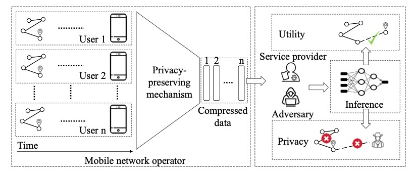

# Mo-PAE

Here is the code for the implementation of Mo-PAE network.
Due to some data security, we only share a sample data of Geolife (preprocessed already), in the sample_trainingdata folder.



## Training Setting for the results in the paper:

i) all the experiments are performed with the Tesla V100 GPU; 

ii) a round of training would take 30 seconds on average; 

iii) and each experiment trains for 1000 rounds.

The main goal of the proposed adversarial network is to learn an efficient feature representation based on the utility and privacy budgets, using all users' mobility histories. In most experiments in this work, the trajectory sequences consist of 10 historical locations with timestamps, and the impact of the varying sequence lengths is discussed.
After data pre-processing, 80\% of each user's records are segmented as the training set and the remaining 20\% as the testing set. We utilize the mini-batch learning method with the size of 128 to train the model until the expected convergence. We take a gradient step to optimize the sum loss in terms of L_R, L_U, and L_P concurrently. Meanwhile, the L_sum is optimized by using the Adam optimizer. 

### All you need to begin with:

1. Using Python virtual environments (this code works for version 3.9 and 3.10) and check the dependencies

```
$ python3 -m venv ./venv
$ source venv/bin/activate
(venv) $ pip3 install -r requirements.txt
```

2. Data pre-processing, direct to the the sampledata folder, 
```
cd sampledata/
```
then coverting the GPS data to POI data, run
```
python3 gridpreprocessing.py
```
It will generated a POI-version data, which will be fed into the Mo-PAE network (i.e., input file for the next step.)

3. Implementation of the Mo-PAE network described in the paper, first back to the main folder, 
```
cd ..
```

then run main network (i.e., Mo-PAE)

```
python3 mopae.py
```
This will take time, for your convenience, please change the "EPOCHS = 1000" to "EPOCHS = 1" and see if it works properly before any other exploration.

(Tips: we run the code on the GPU node, it might be easier if you could test it on simialr setting)


### For the comparsion model

Please refer to:

(A) LSTM-TrajGAN: https://github.com/GeoDS/LSTM-TrajGAN

(B) GI-DP:https://github.com/LapisIT/differential_privacy

### Datasets

(1) [Priva'Mov](https://projet.liris.cnrs.fr/privamov/project/)

(2) [GeoLife](https://www.microsoft.com/en-us/research/publication/geolife-gps-trajectory-dataset-user-guide/)

(3) [FourSquare](https://sites.google.com/site/yangdingqi/home/foursquare-dataset)

(4) [MDC](https://www.idiap.ch/project/mdc/front-page)


#### Reference


